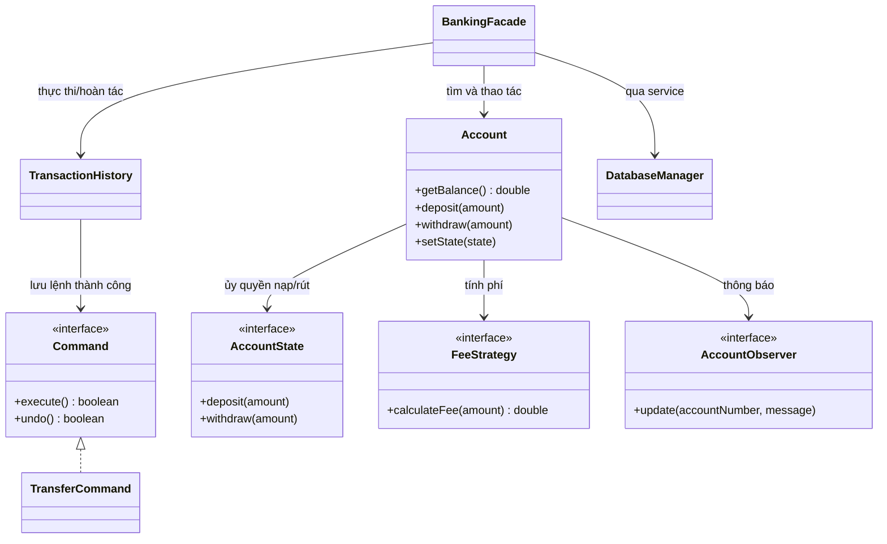
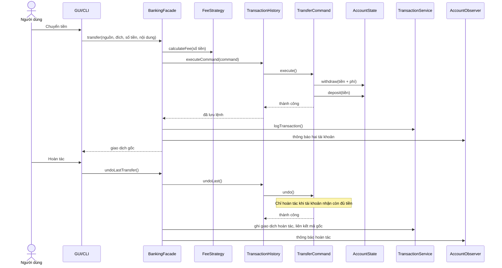

# Thiết kế hệ thống ngân hàng mô phỏng

## Bài toán và phạm vi

Ứng dụng minh họa 9 mẫu thiết kế qua các thao tác mở tài khoản, nạp/rút tiền, chuyển khoản, hoàn tác và xem thông báo. Dữ liệu được giữ trong bộ nhớ khi chạy và lưu bền vững bằng SQLite. Đây là mô phỏng phục vụ môn Mẫu thiết kế, không phải hệ thống giao dịch ngân hàng thật.

## Sơ đồ lớp chính

## Luồng chuyển khoản và hoàn tác

## Vai trò của từng pattern

- **Builder:** `Account.Builder` gom tham số khởi tạo tài khoản; `build()` kiểm tra tên, số tài khoản và sự khớp giữa trạng thái với State.
- **Singleton:** `DatabaseManager` là một kho dữ liệu dùng chung trong tiến trình, khôi phục và lưu tài khoản/giao dịch qua SQLite. `AccountService` cấp số tài khoản duy nhất trong một tiến trình.
- **Prototype:** `TransferTemplate.clone()` tạo bản sao mẫu chuyển tiền; sửa bản sao không đổi mẫu gốc.
- **Proxy:** `AccountProxy` kiểm tra vai trò trước khi chuyển lời gọi đến `RealAccount`; `READONLY` chỉ xem số dư. Màn hình này minh họa pattern; đăng nhập ứng dụng dùng ADMIN/STAFF/VIEWER riêng.
- **Facade:** `BankingFacade` là cửa vào nghiệp vụ của GUI và CLI. Nó kiểm tra điều kiện, tính phí, gọi Command, lưu giao dịch và kích hoạt thông báo.
- **Command:** `TransferCommand` đóng gói chuyển khoản và phép đảo ngược; `TransactionHistory` chỉ lưu lệnh thực thi thành công và giữ lệnh lại nếu undo thất bại.
- **Observer:** tài khoản phát thông báo cho SMS, Email, vùng log UI và đồng bộ dữ liệu thời gian thực lên Dashboard (biểu đồ PieChart tỷ trọng số dư và LineChart biến động tài chính tự động cập nhật ngay khi phát sinh giao dịch).
- **State:** `ActiveState` cho phép nạp/rút; `LockedState` cho phép nhận tiền nhưng chặn rút. Việc đổi State tự đồng bộ `AccountStatus` và hỗ trợ thao tác khóa/mở nhanh trực tiếp trên từng thẻ tài khoản ở Dashboard.
- **Strategy:** từng loại tài khoản chọn một cách tính phí; phí giao dịch được làm tròn đến đồng trước khi ghi sổ.

## Quy tắc nghiệp vụ để demo và kiểm thử

1. Số tiền phải hữu hạn, lớn hơn 0 sau khi làm tròn đến 1 VND. Số dư không được âm.
2. Tài khoản nguồn phải hoạt động, nguồn và đích phải khác nhau, nguồn phải đủ số tiền cộng phí.
3. Giao dịch thất bại không tạo lịch sử, không gửi thông báo và không vào ngăn xếp undo.
4. Undo hoàn lại tiền và phí cho nguồn, trừ tiền từ đích, đồng thời ghi giao dịch mới có `relatedTransactionId` trỏ đến giao dịch gốc. Nếu đích thiếu tiền, undo bị từ chối và lệnh vẫn còn trong ngăn xếp.
5. SQLite lưu tài khoản, số dư, lịch sử và người dùng qua các lần khởi động. Số dư và dòng lịch sử của mỗi giao dịch được ghi trong cùng một SQLite transaction. Chạy `mvnw test` để kiểm tra các tình huống chính trước buổi demo.

## Giới hạn và hướng mở rộng

- UI và một số interface cũ còn dùng `double`; lớp lõi `Money` chuyển sang `BigDecimal` khi ghi số dư và giao dịch. Nếu phát triển thành sản phẩm thật, nên đổi toàn bộ API tiền sang `BigDecimal` hoặc kiểu `Money` bất biến.
- Ứng dụng hiện dành cho một máy/một phiên chạy tại một thời điểm. Chưa có máy chủ nhiều người dùng, đồng bộ liên máy, phục hồi mật khẩu hay tích hợp ngân hàng thật.
- Hoàn tác là giao dịch bù trừ của mô phỏng. Trong hệ thống ngân hàng thật, quy tắc hoàn tiền và phê duyệt sẽ phức tạp hơn.
